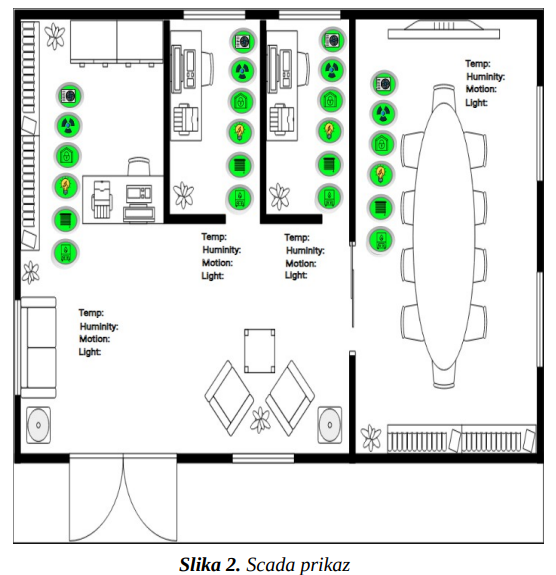

# IBIS Projekat - SCADA Simulator

Ovaj repozitorijum sadrži projekat iz predmeta IBIS koji su izradili Milos Pantelić, Cvjetin Glisić i Stefan Popović.

## Opis Projekta

U okviru projekta implementiran je sistem za nadgledanje i kontrolu parametara unutrašnjeg prostora. Za implementaciju su korišćeni programski jezik Python, EMQX aplikacija (koja implementira MQTT protokol kao Docker kontejner), Hive MQTT Broker (koji takođe implementira MQTT protokol) i InView Cloud SCADA.


Aplikacija se sastoji od tri glavne komponente: Simulatora, Klijenta i InView SCADA sistema, koji međusobno komuniciraju putem MQTT protokola.

### Simulator

Simulator je Python aplikacija koja koristi dokerizovanu EMQX aplikaciju za simulaciju MQTT protokola i komunicira sa MQTT Klijentom. Unutar Simulatora se izvršava logika provere trenutnih parametara i simulira ponašanje sistema u zavisnosti od toga da li su određeni uređaji uključeni ili isključeni.

### MQTT Klijent

MQTT Klijent, takođe Python aplikacija, komunicira sa Simulatorom i InView SCADA sistemom putem MQTT protokola. Unutar MQTT Klijenta se proveravaju parametri senzora i upravljaju uređajima na osnovu graničnih vrednosti kako bi očitavanja senzora ostala u normalnim granicama. HiveMQ Broker omogućava komunikaciju sa SCADA sistemom koristeći paho-mqtt paket.

### InView SCADA

InView Cloud SCADA rešenje omogućava daljinsko nadgledanje, upravljanje i prikupljanje podataka
pomoću web pretraživača. Sistem je podeljen na dva glavna dela: Editor i Client.
Editor
Ovaj modul je namenjen za konfiguraciju i kreiranje prikaza koji će se kasnije koristiti na Client-u. Da
bi SCADA sistem mogao da prikuplja podatke, neophodno je definisati sledeće elemente unutar
Editora:
 1. Connections: Ovaj element uspostavlja vezu sa MQTT brokerom, preko kojeg se prate topic-i
(varijable u InView) i šalju promene tih varijabli.
 2. Devices: Ovaj deo omogućava definisanje uređaja.
 3. Variables: Ovaj element služi za definisanje varijabli, uključujući ime, tip, i ostale atribute



## Uputstvo za Pokretanje Sistema

1. Preuzmite Docker sliku za EMQX broker izvođenjem sledeće komande u terminalu:
    ```sh
    docker pull emqx:latest
    ```

2. Pokrenite EMQX broker koristeći sledeću komandu:
    ```sh
    docker run -d --name emqx -p 18083:18083 -p 1883:1883 emqx:latest
    ```
4. Podesite WeatherForecastClient tako sto cete uneti vas api key
5. Podesiti kredencijale EMTT Brokera unutar MQTT_Broker.py

6. Nakon uspešnog pokretanja EMQX brokera putem Docker-a, pokrenite `Startup.py` unutar Simulatora i SCADA Klijenta.

7. Na InView SCADA sistemu možete pratiti promene vrednosti i uključivanje/isključivanje uređaja.


DOKUMENTACIJA U PDF FORMATU:  https://drive.google.com/file/d/1w-ckcLhGuN1BFcv6XLYRXMN8m1y4nUWy/view?usp=drive_link